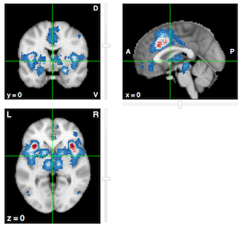

```{r "setup", include=FALSE}
knitr::opts_chunk$set(
	echo = TRUE,
	message = FALSE,
	comment = NA,
	cache = FALSE,
	warning = FALSE,
	fig.align='center'
)

# Libraries
library(tidyverse)
library(purrr)
library(oro.nifti)
library(neurobase)
library(mvmeta)
library(metafor)
library(ggridges)
library(NeuRRoStat)

# Custom function
ExtractTau <- function(Y, V){
  fit <- rma(yi = Y, vi = V, method = "DL")
  return(fit$tau2)
}
```


```{r 'empty-grid', eval = FALSE, echo = FALSE, fig.width = 2, fig.height = 1.9, fig.align='center'}
plot.new()
```

&nbsp;
&nbsp;

```{r 'cover-image', echo = FALSE, fig.width = 6, fig.height = 6, fig.align='center', cache=TRUE}
# Read in object
dataG <- readRDS('Images/cover_data.rds')
# Plot for cover of PDF
ggplot(dataG, aes(y = study, x = hedgeG)) +
  geom_density_ridges2(aes(fill = samplesize), scale = 2) +
  scale_y_discrete('Study', expand = c(0.01, 0)) +
  scale_x_continuous("Hedges' g", expand = c(0.01, 0)) +
  scale_fill_gradient2('Sample size', 
                       low = '#3288bd',
                       mid = '#ffffbf',
                       high = '#d53e4f') +
  guides(fill = 'none') +
  theme_ridges() +
  ggtitle('Artwork') +
  theme(text = element_text(size=10),
        axis.text = element_text(size=10))
```


\pagebreak

# Introduction

In this report, we estimate the amount of observed between-study heterogeneity in a typical image-based fMRI meta-analysis. The goal is to obtain reasonable values for between-study heterogeneity so that we can use these in Monte-Carlo simulation studies.

At the moment, we have a database of 32 fMRI studies (N = 631) involving a general experience of pain versus no pain. This database could be actively extended/curated.

# Database
The following [link ](https://github.com/NeuroStat/IBMAvsGLM/tree/bsvar/1_Scripts/CI_IBMAvsGLM/Simulations/Activation/BSVar) contains general information about the database. In general, we are interested in the effect of experiencing pain versus a baseline or versus experiencing no pain. We explicitly use a general definition of _pain_ to obtain upper bounds on the observed between-study heterogeneity. Hence, we have studies that investigate the empathy of pain (i.e. seeing others having pain) or studies in which painful stimuli are given. There are multiple simuli available ranging from auditory, thermal to mechanical stimuli.

## Collection procedure
All studies are collected using the search term _pain_ in [NeuroVault](www.neurovault.org) at 11/01/2017. Results are manually checked and inputted in the database. 

Note that we do not follow guidelines (such as the [PRISMA](http://www.prisma-statement.org) guidelines) on how to collect/report studies for a meta-analysis/systematic review. Although we might add these in the future, it would involve putting more infort in collecting images that are not available through NeuroVault. 

## Overview of database

The database contains the following studies:


| Study        | Sample size           | Type  |  Contrast |
| ---------------- |:-----------|:---------:|:--------------------------------------:|
|Braboszcz 2017 | 17            | T-map | Painful images >Painless images (Normal state) |
| Hebestreit 2017      | 23      |   T-map | Ammonia stimulation (trigeminal pain) > Air in both sessions (medication and placebo) |
| Tamm 2017 | 86      |  T-map | Pain > no pain [no covariates] |
| Karjalainen 2017 | 35      |  T-map | Main effect of vicarious pain |
| Atlas 2010 | 15      |  $\text{beta-map}^1$ | Thermal high vs low stimulation pain |
| Wager 2013 | 15      |  $\text{beta-map}^1$ | Somatic pain vs baseline |
| Kano 2017 | 15      |  $\text{beta-map}^1$  | Visceral pain vs baseline |
| Rubio 2015 | 15      |  $\text{beta-map}^1$  | Visceral pain vs baseline |
| Unpublished | 15      |  $\text{beta-map}^1$  | Mechanical high pressure pain vs baseline |
| Unpublished | 15      |  $\text{beta-map}^1$  | Mechanical medium pressure pain vs baseline |
| Patil 2017 | 46      |  T-map | Outcome of pain induced to others versus baseline |
| Maumet 2016 | Total = $334^2$      |  T-maps | Pain versus baseline |

Some notes:

* We only include whole-brain analyses.
* 1) Data comes from Kragel et al, 2017. We need to pool the subjects using OLS. I assume the provided data from this study are first level beta parameter estimates each subject. Should verify with Tor Wager.
* 2) Study of Maumet et al., 2016 is about the *nidm* data structure. However, it contains **21** studies about pain. Note that these come from the same site! Might need to control for when estimating between-study variability. Also, need to verify where these studies came from etc. 

## ROI

In order to see whether between-study heterogeneity is different in brain areas known to involved in pain processing, we also create a Region of Interest (ROI). 
To do so, we create a binary mask using [NeuroSynth](www.neurosynth.org). After searching for the term _pain_, we obtain an automated meta-analysis of 420 studies. From here we use forward inference with a False Discovery Rate control at 0.01, the standard neurosynth procedure to create a mask. Forward inference is equal to: P(Activation|Term). 

Figure 1 shows the obtained regions of interests using this procedure. 



## Pre-processing

The main pre-processing step involves getting the statistical parametric maps (mostly _t_-images) to the same MNI 2mm space. This is simply done through resampling within the FSL GUI. This technique involves changing the dimensions of the voxels so that the overal image matches in dimension with the MNI standard.
We tried to do registration using _flirt_ or _fnirt_ to MNI space. However, we were unable to achieve reasonable registrations. 

# ROI Analysis

## Read in data

First we read in the meta-data about the database (name of files and sample sizes).
We also read in the ROI mask. 
```{r 'meta-data'}
# Number of studies
nstud <- 32
database <- read.csv2('database.csv', header = TRUE, stringsAsFactors = FALSE)
# Read in ROI mask 
ROI <- readNIfTI2('pain_pAgF_z_FDR_0.01_forward_mask')[,,]
# Dimension in 3D
DIM3D <- dim(ROI)
# Switch to array
ROI <- array(ROI, dim = prod(DIM3D))
# MNI standard (2mm)
MNI <- readNIfTI2('MNI152_T1_2mm_brain')[,,]
# MNI mask
MNImask <- readNIfTI2('MNI152_T1_2mm_brain_mask')[,,]
```

Now we load in all t-maps. 

```{r 'read-data', cache = TRUE, cache.rebuild=FALSE}
# Empty data matrix
allStud <- matrix(NA, nrow = prod(DIM3D), ncol = nstud)

# For loop over the studies
for(i in 1:nstud){
  # Name of dataset is first column of database
  studDat <- readNIfTI2(paste('Data/', database[i,'img'], '.nii', sep = ''))[,,]
    # Check if dimensions match
    if(all(dim(studDat) != DIM3D)) stop(paste0('Dimension of image ', i,
                                               'does not match MNI space'))
  # Switch to vector
  studDat <- array(studDat, dim = prod(DIM3D))
  # Values outside MNI mask to NA
  studDat[MNImask == 0] <- NA
  # Bind to data matrix
  allStud[,i] <- studDat
  # Reset
  rm(studDat)
}

# Distribution of all t-values
distrAllT <- data.frame(allStud) %>% as.tibble()
  names(distrAllT) <- paste('S', 1:nstud, sep = '')
distrAllT <- gather(distrAllT, key = 'study', value = 'Tvalue')
# Now only for masked values
distrAllT <- data.frame(distrAllT, ROImask = rep(ROI, nstud)) %>% as.tibble()
maskedVox <- filter(distrAllT, ROImask == 1)
# Create factor of study
maskedVox$study <- factor(maskedVox$study, levels = paste('S', 1:nstud, sep = ''))
```


## Distributions of t-values

Before focussing on distributions within ROI, let us look at the distribution of the t-values over all voxels in each study.

```{r 'distr-t-all', fig.align='center', fig.width=6, fig.height=6, cache = TRUE, cache.rebuild=FALSE}
# Raw ridge plot
ggplot(distrAllT, aes(y = study, x = Tvalue)) +
  geom_density_ridges2()
```

Now we plot the distributions of the t-values within the ROI. See caption of note on subdivission.

```{r 'distr-t-ROI', fig.show='hold', fig.height=8}
# Add variable for Kragel, Maumet and other study
IDvar <- c(rep('Other',4), rep('Kragel', 6), 'Other', rep('Maumet', 21))
maskedVox$IDvar <- factor(rep(IDvar, each = sum(ROI)))
# Violin plot
ggplot(maskedVox, aes(x = study, y = Tvalue)) +
  geom_violin(aes(fill = IDvar)) +
  scale_y_continuous('T-value') +
  scale_x_discrete('Study') +
  scale_fill_brewer('ID study*', type = 'qual', palette = 3) +
  ggtitle("T-values from voxels in ROI") + 
  theme(legend.position = 'top') +
  labs(caption = "*t-values from Kragel are obtained through OLS. \n 
       Studies from Maumet are from same site.")
# Ridge plot
ggplot(maskedVox, aes(y = study, x = Tvalue)) +
  geom_density_ridges2(aes(fill = IDvar)) +
  scale_y_discrete('Study', expand = c(0.01, 0)) +
  scale_x_continuous('T-value', expand = c(0.01, 0)) +
  scale_fill_brewer('ID study*', type = 'qual', palette = 3) +
  ggtitle("T-values from voxels in ROI") +
  labs(caption = "*t-values from Kragel are obtained through OLS. \n 
       Studies from Maumet are from same site.") +
  theme_ridges() +
  theme(legend.position = 'top')
```


## Distributions of effect sizes

First we transform the reported t-value for each voxel to Hedges' _g_.

This is done through:
\begin{align}
g = \frac{t}{\sqrt{N}} \times J,
\end{align}
with $N$ the study sample size and *J* a correction factor, defined as:
\begin{align}
J = 1 - \left( \frac{3}{(4 \times (N - 1)) - 1} \right).
\end{align}

We also calculate the within-study variance through:
\begin{align} \label{varHedge}
\text{Var}(g) & = \frac{1}{N} + \left[ 1 -  \left( \frac{\Gamma((N - 2) / 2)} {\Gamma((N - 1) / 2)} \right) ^{2} \times \frac{(N - 3)}{2} \right] \times g^2
\end{align}

```{r 'transformation-t-to-g'}
dataG <- database %>% as.tibble() %>%
  mutate(study = factor(paste('S', 1:nstud, sep = ''),
                        levels = paste('S', 1:nstud, sep = ''))) %>%
  select(-img) %>% right_join(., maskedVox, by = 'study') %>%
  arrange(samplesize) %>% 
  # Now transform to hedges' g and calculate variance
  mutate(hedgeG = hedgeG(t = Tvalue, N = samplesize),
         varG = varHedge(g = hedgeG, N = samplesize))
```

Now we plot the distributions of _g_ within the ROI, according to the sample size. 


```{r 'plot-g', fig.height=8, fig.width=8}
OrderFactorSS <- database %>% as.tibble() %>%
  mutate(study = factor(paste('S', 1:nstud, sep = ''),
            levels = paste('S', 1:nstud, sep = ''))) %>%
            select(-img) %>% arrange(samplesize)
dataG$study <- factor(dataG$study, levels = rev(OrderFactorSS$study))
ggplot(dataG, aes(y = study, x = hedgeG)) +
  geom_density_ridges2(aes(fill = samplesize), scale = 2) +
  scale_y_discrete('Study', expand = c(0.01, 0)) +
  scale_x_continuous("Hedges' g", expand = c(0.01, 0)) +
  scale_fill_gradient2('Sample size', 
                       low = '#3288bd',
                       mid = '#ffffbf',
                       high = '#d53e4f') +
  ggtitle("Hedges' g from voxels within ROI", 
    subtitle = 'Sorted according to study sample size (bottom to top: high N to low)') +
  theme_ridges()
```

Before we continue, note that smaller studies tend to have more positive distributions. In fact, this could indicate that we have publication bias in our dataset. However, the smallest 6 studies are actually obtained by fitting an OLS model to 15 randomly chosen subjects from their corresponding study dataset. Hence these studies are not an actual representation of the published work. 
Aside from these 6, the smaller studies do tend to show more positive effect sizes. 


## Meta-analysis

Now let us estimate the weighted averages using a random-effects model with the method of moments estimator for between-study heterogeneity. We will extract the weighted average (denoted as $\beta$) and the method of moments estimate for $\tau^2$, the between-study variability. Note that the latter is a standardized measure and hence operates on the same scale as Hedges' _g_. 
We also extract a measure for heterogeneity $I^2$ defined as:
$$
I^2 = \frac{Q - df}{Q} \times 100\%.
$$
Here, $Q$ is the amount of obseved dispersion between studies. Since this quantity is measured on a standardized scale, its expected value equals $df$, the degrees of freedom. Therefore, $I^2$ is the ratio between excess dispersion over total (observed) dispersion. It is a descriptive statistic of the amount of study heterogeneity in relation to the total variability. Note though that we assume homogeneous within-study variability for the interpretation of $I^2$. This is probably not the case! 
Finally, we also extract $H^2$. This is defined as:
$$
H^2 = \frac{Q}{k - 1}.
$$


```{r 'MA-calculation', cache=TRUE, cache.rebuild=FALSE}
# First add voxel ID to dataframe
voxID <- dataG %>% mutate(voxel = rep(1:sum(ROI), nstud))

# Although purrr is a bit slower, it is possible to conveniently 
#     extract multiple coefficients.
# We also extract I2, H2 and the beta estimate (which is the weighted average).
estTau <- voxID %>% split(.$voxel) %>% 
  map(~ rma(yi = hedgeG, vi = varG, method = 'DL', data = .)) %>%
  map_df(., magrittr::extract, c("tau2", "I2", "H2", "beta"))
```


Let us plot the distributions over all voxels in the ROI of these 4 parameters. 

```{r 'distributions-4-parameters', fig.height=5, fig.width=5}
estTau %>% gather(key = 'Parameter', value = 'Value') %>%
  ggplot(., aes(x = Parameter, y = Value)) +
  geom_violin(aes(fill = Parameter), alpha = 0.5) +
  scale_fill_brewer('', type = 'qual', palette = 5) +
  facet_wrap(~ Parameter, scales = 'free', ncol = 1) +
  coord_flip() +
  scale_x_discrete('Parameter', labels = c('beta' = expression(beta),
        'H2'   = expression(H^2),
        'I2'   = expression(I^2),
        'tau2'   = expression(tau^2))) +
  guides(fill = FALSE)  + 
  ggtitle('Observed distributions of various parameters inside ROI') +
  theme_bw() +
  theme(strip.background = element_blank(),
    strip.text.x = element_blank())
```

Overal, we observe mostly positive effect sizes within the ROI. For most voxels within the ROI, we estimate a modest amount of between-study heterogeneity ($\tau^2$). However, the maximum observed estimate for $\tau^2$ equals ```r max(estTau$tau2)```. This seems not trivial considering we only observe a maximum effect size of ```r max(estTau$beta)```.
Recall that we could roughly state that 95% of the true effects will fall in the range of:
$$
\hat\beta \pm 1.96 \hat\tau
$$
For instance, consider the voxel with the highest value for $\hat\tau$:
```{r 'highest-tau'}
filter(estTau, tau2 == max(tau2))
```
We then get 95% of the true effects for this voxel within the interval:
[```r 0.8432343 - 1.96 * sqrt(max(estTau$tau2))```;```r 0.8432343 + 1.96 * sqrt(max(estTau$tau2))```].

To see which values for the estimated effect sizes are associated with $\tau^2 > 0.20$, we look at the following two figures:

```{r 'tau2-with-es', fig.width = 8}
estTau %>% filter(tau2 >= 0.20) %>% select(tau2, beta) %>%
  gather(key = 'Parameter', value = 'Value') %>%
  ggplot(., aes(x = Parameter, y = Value)) +
  geom_violin(aes(fill = Parameter), alpha = 0.6) +
  scale_fill_brewer('', type = 'qual', palette = 6) +
  facet_wrap(~ Parameter, scales = 'free', ncol = 1) +
  coord_flip() +
  scale_x_discrete('Parameter', labels = c('beta' = expression(beta),
        'tau2'   = expression(tau^2))) +
  guides(fill = FALSE)  +
  ggtitle(expression(Observed ~ distributions ~ of ~ weighted ~ average ~ when ~ tau^2 >= 0.20)) +
  theme_bw() +
  theme(strip.background = element_blank(),
    strip.text.x = element_blank())
```

```{r 'hair-plot-beta-to-tau'}
lineData <- estTau %>% filter(tau2 >= 0.20) %>%
  select(tau2, beta) %>%
  mutate(x = 'beta', xend = 'tau2')

estTau %>% filter(tau2 >= 0.20) %>% select(tau2, beta) %>%
  gather(key = 'Parameter', value = 'Value') %>%
  ggplot(aes(x = Parameter, y = Value)) + 
  geom_point(aes(colour = Value), size = 0.5) + 
  geom_segment(data = lineData, 
               aes(x = x, xend = xend,
               y = beta, yend = tau2,
               colour = beta),
               size = 0.2,
               alpha = 0.2) +
  guides(colour = FALSE) +
  scale_x_discrete(name = 'Parameter',
                   labels = c(beta = expression(beta), 
                            tau2 = expression(tau^2))) +
  ggtitle(expression(Relation ~ between ~ weighted ~ average ~ and ~ (tau^2 >= 0.20)),
          subtitle = 'Every line/dot represents a voxel within the ROI') +
  theme_bw()
```


It seems that larger effect sizes are associated with both larger values for $\tau2$ and modest values for $\tau^2$. 


Next, we also observe fairly large values for $I^2$. Higgins et al. (2003) suggested the following benchmarks for $I^2$: 25% = low, 50% = moderate and 75% = high.

To summarise, we provide the quantiles for $\tau^2$ and $I^2$ in table 2.
```{r 'table-quantile-tau'}
knitr::kable(data.frame(tau2 = quantile(estTau$tau2, probs = seq(0,1,by = 0.05)),
                        I2 = quantile(estTau$I2, probs = seq(0,1,by = 0.05)),
           Quantile = paste(seq(0,1,by = 0.05) * 100, '%', sep = '')), 
      caption = 'Quantiles for estimated between-study variability in ROI',
      row.names = FALSE, format = 'latex', booktabs = TRUE,
      col.names = c("$\\tau^2$", "$\\I^2$", "Quantile"),
      digits = 3)
```

## Brain images

Let us plot the observed weighted averages onto the anatomical MNI image.


```{r 'plot-weighted-avg-ROI', fig.width=8}
# Weighted averages back to 3D
wAvg_3D <- array(NA, dim = DIM3D)
wAvg_3D[ROI == 1] <- estTau$beta

# Coordinate: center of MNI
xyz <- c(45, 63, 36)

# Plot using ortho2 
ortho2(x = MNI, y = wAvg_3D, xyz = xyz, ycolorbar = TRUE, 
        ybreaks = c(seq(min(wAvg_3D, na.rm = TRUE),
                        max(wAvg_3D, na.rm = TRUE),length.out = 65)),
       text = "Empirical weighted average within ROI",
       text.cex = 1)
```


And now the same for between-study variability.

```{r 'plot-tau-ROI', fig.width=8}
# Weighted averages back to 3D
tau_3D <- array(NA, dim = DIM3D)
tau_3D[ROI == 1] <- estTau$tau2

# Coordinate: center of MNI
xyz <- c(45, 63, 36)

# Plot using ortho2 
ortho2(x = MNI, y = tau_3D, xyz = xyz, ycolorbar = TRUE, 
        ybreaks = c(seq(min(tau_3D, na.rm = TRUE),
                        max(tau_3D, na.rm = TRUE),length.out = 65)),
       text = "Estimated between-study variability \n  (tau^2) within ROI",
       text.cex = 1)
```

# Whole brain analysis

In this section, we compare the ROI analysis with a whole brain analysis. 
I am especially interested in checking whether there would be a different distribution of between-study heterogeneity in regions that are not systematically involved in _pain_ processing. 

## Distributions of effect sizes

Now let us look at the distributions of the effect sizes in the entire brain for each study.

```{r 'transformation-t-to-g-wb', cache=TRUE}
data_all_G <- database %>% as.tibble() %>%
  mutate(study = factor(paste('S', 1:nstud, sep = ''),
                        levels = paste('S', 1:nstud, sep = ''))) %>%
  select(-img) %>% right_join(., distrAllT, by = 'study') %>%
  arrange(samplesize) %>% 
  # Now transform to hedges' g and calculate variance
  mutate(hedgeG = hedgeG(t = Tvalue, N = samplesize),
         varG = varHedge(g = hedgeG, N = samplesize))
```


```{r 'plot-g-wb', fig.height=8, fig.width=8, cache = TRUE}
data_all_G$study <- factor(data_all_G$study, levels = rev(OrderFactorSS$study))
ggplot(data_all_G, aes(y = study, x = hedgeG)) +
  geom_density_ridges2(aes(fill = samplesize), scale = 2) +
  scale_y_discrete('Study', expand = c(0.01, 0)) +
  scale_x_continuous("Hedges' g", expand = c(0.01, 0)) +
  scale_fill_gradient2('Sample size', 
                       low = '#3288bd',
                       mid = '#ffffbf',
                       high = '#d53e4f') +
  ggtitle("Hedges' g from ALL voxels", 
    subtitle = 'Sorted according to study sample size (bottom to top: high N to low)') +
  theme_ridges()
```

There is a clear dominance of zero valued voxels. However, there are also voxels with negative values for Hedges' _g_.

## Meta-analysis

Now let us again estimate a random effects model. 

```{r 'MA-calculation-wb', cache=TRUE}
# First add voxel ID to dataframe
voxID_all <- data_all_G %>% mutate(voxel = rep(1:prod(DIM3D), nstud))

# Although purrr is a bit slower, it is possible to conveniently 
#     extract multiple coefficients.
# We also extract I2, H2 and the beta estimate (which is the weighted average).
# Note that we only process the masked voxels.
estTau_all <- voxID_all %>% 
  mutate(MNImask = rep(array(MNImask, dim = prod(DIM3D)), nstud)) %>%
  filter(MNImask == 1) %>%
  split(.$voxel) %>% 
  map(~ rma(yi = hedgeG, vi = varG, method = 'DL', data = .)) %>%
  map_df(., magrittr::extract, c("tau2", "I2", "H2", "beta"))
```


Let us plot the distributions of these 4 parameters over all voxels in the MNI mask. 

```{r 'distributions-4-parameters-wb', fig.height=5, fig.width=5}
estTau_all %>% gather(key = 'Parameter', value = 'Value') %>%
  ggplot(., aes(x = Parameter, y = Value)) +
  geom_violin(aes(fill = Parameter), alpha = 0.5) +
  scale_fill_brewer('', type = 'qual', palette = 5) +
  facet_wrap(~ Parameter, scales = 'free', ncol = 1) +
  coord_flip() +
  scale_x_discrete('Parameter', labels = c('beta' = expression(beta),
        'H2'   = expression(H^2),
        'I2'   = expression(I^2),
        'tau2'   = expression(tau^2))) +
  guides(fill = FALSE)  + 
  ggtitle('Whole brain distributions of various parameters') +
  theme_bw() +
  theme(strip.background = element_blank(),
    strip.text.x = element_blank())
```

## Brain images

Let us plot the observed weighted averages onto the anatomical MNI image.

```{r 'plot-weighted-avg-wb', fig.width=8}
# Weighted averages back to 3D
wAvg_3D <- array(NA, dim = DIM3D)
wAvg_3D[MNImask == 1] <- estTau_all$beta

# Coordinate: center of MNI
xyz <- c(45, 63, 36)

# Plot using ortho2 
ortho2(x = MNI, y = wAvg_3D, xyz = xyz, ycolorbar = TRUE, 
       NA.y = FALSE,
        ybreaks = c(seq(min(wAvg_3D, na.rm = TRUE),
                        max(wAvg_3D, na.rm = TRUE),length.out = 65)),
       text = "Whole brain empirical weighted averages",
       text.cex = 1)
```

And now the same for between-study variability.

```{r 'plot-tau-wb', fig.width=8}
# Weighted averages back to 3D
tau_3D <- array(NA, dim = DIM3D)
tau_3D[MNImask == 1] <- estTau_all$tau2

# Coordinate: center of MNI
xyz <- c(45, 63, 36)

# Plot using ortho2 
ortho2(x = MNI, y = tau_3D, xyz = xyz, ycolorbar = TRUE, 
       NA.y = FALSE,
        ybreaks = c(seq(min(tau_3D, na.rm = TRUE),
                        max(tau_3D, na.rm = TRUE),length.out = 65)),
       text = "Whole brain estimated between-study \n variability (tau^2)",
       text.cex = 1)
```


## Comparing ROI with other brain areas

In the following, we plot the distributions of the 4 estimated parameters for the voxels inside the ROI versus those outside the ROI but still inside MNI mask. 


```{r 'plot-distr-ROI-vs-other', fig.width=8, fig.height=8}
# First we identify the voxels inside MNI space that are within mask
voxID_MNI <- data.frame(MNI = array(MNImask, 
                dim = prod(dim(MNImask)))) %>% as.tibble() %>%
  mutate(voxID = 1:prod(dim(MNImask))) %>% 
  filter(MNI == 1)

# Same, but for voxels inside ROI
voxID_ROI <- data.frame(ROI = ROI) %>% as.tibble() %>%
  mutate(voxID = 1:length(ROI)) %>% 
  filter(ROI == 1)

# We add these voxel IDs to the estimated parameters from whole brain
# We start through a full join
ROIvsOther_param <- full_join(
  # We have data from the entire brain, gathered and info about voxID
  estTau_all %>% gather(key = 'Parameter', value = 'Value') %>%
    mutate(WB = 1,
      voxID = rep(voxID_MNI$voxID, 4))
  ,
  # Now we have data from the ROI, gathered and info about voxID
  estTau %>% gather(key = 'Parameter', value = 'Value') %>%
    mutate(ROI = 1,
      voxID = rep(voxID_ROI$voxID, 4))
  # Now we join by the parameter, its value and voxID
  # This is possible as the whole brain also contains all the ROI values.
  # So these are duplicated at the moment.
  , by = c("Parameter", "Value", "voxID")) %>%
  # We continue by creating a label. If ROI is missing, then this voxel is 
  #     outside ROI. Otherwise inside ROI.
  mutate(Area = ifelse(is.na(ROI), 'Other', 'ROI'))

# Let us now plot these two distributions
ROIvsOther_param %>%
  ggplot(., aes(x = Parameter, y = Value)) +
  geom_violin(aes(fill = Area), alpha = 0.7) +
  scale_fill_brewer('Brain area', type = 'qual', palette = 2) +
  facet_wrap(~ Parameter, scales = 'free', ncol = 1) +
  coord_flip() +
  scale_x_discrete('Parameter', labels = c('beta' = expression(beta),
        'H2'   = expression(H^2),
        'I2'   = expression(I^2),
        'tau2'   = expression(tau^2))) +
  ggtitle('Distributions of parameters within ROI versus other masked brain areas.') +
  theme_bw() +
  theme(strip.background = element_blank(),
    strip.text.x = element_blank(),
    legend.position = 'top')
```

There are two main differences between voxels known to be involved in pain processing versus other brain areas.
First there are more voxels with higher effect sizes within the ROI compared to other brain areas (top row in previous figure). Second, we observe more between-study heterogeneity within these brain areas. There are higher maximum values for $H^2$, $I^2$ and $\tau^2$ as well as more voxels with higher values. 

There is no real point in running a t-test to compare the means of both groups with estimated values for $\tau^2$ as we have so many datapoints. For completeness:

```{r 't-test-other-vs-ROI-tau'}
other_tau2 <- filter(ROIvsOther_param, Area == 'Other' & Parameter == 'tau2') %>% 
  select(Value) %>% unlist(.) %>% as.numeric(.)
ROI_tau2 <- filter(ROIvsOther_param, Area == 'ROI' & Parameter == 'tau2') %>% 
  select(Value) %>% unlist(.) %>% as.numeric(.)
t.test(x = ROI_tau2, y = other_tau2, 
      alternative = 'two.sided', paired = FALSE)
```

\pagebreak

# Preliminary conclusion

In this report, we analyzed a database of 32 fMRI (whole-brain) studies involving the experience of _pain_. We were interested in estimating the empirical distribution of between-study heterogeneity. In order to obtain estimates within brain areas that are known to be involved in _pain_ processing, we first generated a mask containing a Region of Interest (ROI). This was done using forward inference (P[Activation|Term]) with NeuroSynth. Next we did a meta-analysis with a random-effects model. We used the method of moments estimator for between-study variability and obtain the following conclusions:

* While the majority of voxels within the ROI show a fairly low amount of excess heterogeneity, between-study variability is not negligible. 
* To see, consider that the top 5% of observed values for Hedges' _g_ within the ROI are between [```r round(quantile(estTau$beta, prob = 0.95),3)```; ```r round(max(estTau$beta),3)```]. Then, the top 5% of observed values for $\hat\tau^2$ are between [```r round(quantile(estTau$tau2, prob = 0.95),3)```; ```r round(max(estTau$tau2),3)```]. And the top 5% of estimated values for $I^2$ are between [```r round(quantile(estTau$I2, prob = 0.95),3)```; ```r round(max(estTau$I2),3)```]. These values do reveal between-study heterogeneity which is not accounted for in the analysis.
* Furthermore, these higher values for between-study heterogeneity tend to co-occur with higher estimates for the effect sizes.
* A comparisson of the brain regions outside the ROI with those defined in our ROI indeed reveals two elements. First we observe lower effect sizes for brain regions not included in the ROI. Second, we observe lower values for the estimated between-study variability in these brain areas. 


