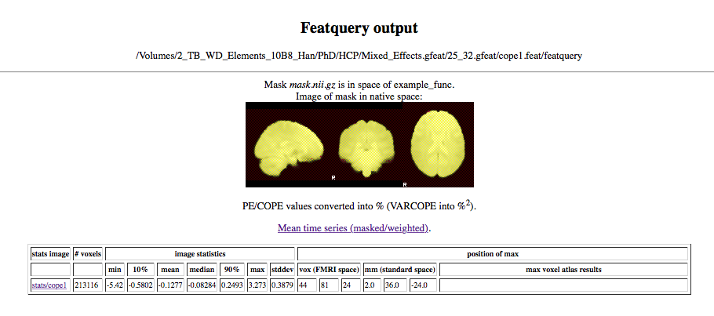

```{r setup, include=FALSE}
knitr::opts_chunk$set(
	echo = TRUE,
	message = FALSE,
	warning = FALSE,
	comment = NA
)
```

## Percent BOLD change.
### Reference
Most of the theory is taken from a PDF from a lecture given at the _Neuroimaging Training Program_ (2008). I assume/think given by Jeanette Mumford. Another helpful resource is called *A Guide to Calculating Percent Change with Featquery* by Jeanette Mumford.

### Effect Sizes
Effect sizes play an important role in describing the magnitude of scientific results. While test statistics are essentially unitless, it is possible to use parameter esimates from the GLM. However, these have no straightforward interpretation in fMRI. Hence, it is common practice in fMRI to convert the parameter estimates to %-signal change. A second option is to convert the obtained parameter estimates to Cohen's _d_.

We will first describe %-signal change. For the first part, I assume we work at the first level. I will also include a note and an example for the second level group analysis.

### Percent signal change
A percent-signal change measures the magnitude of the *predicted* BOLD signal, relative to a baseline. 

$$
\text{%-change} = \frac{signal\ magnitude}{mean} \times 100
$$


In theory, the predicted signal depends on the design matrix (the explanatory variable, EV) and the parameter estimates ($\hat{\beta}$). Thus: $\mathbf{X}\boldsymbol{\beta}$. 

For block designs, one sets the min/max range of the EV typically to 1. To get a rough idea of, one can ignore the post-stimulus undershoot of the HRF. Furthermore, FSL applies a _Grand Mean Scaling_ to **approximately** ```r 100**2```. This is achieved by calculating the global mean of all scans. Then a single scaling factor is applied to each volume (i.e. normalised). Hence, the %-signal change becomes:

$$
\text{%-change} \approx \frac{EV \times \hat{\beta}}{100000} \times 100
$$
Or in a block design:
$$
\text{%-change} \approx \frac{\hat{\beta}}{100}
$$
Note the approximation sign, as the global mean will not always be exact ```r 100**2```.

> For an event related design, this becomes more difficult as the min/max range of the EV is not uniformly identical. Close events have higher min/max ranges. One possibility is to isolate a 2 second event and use the min/max range of this event as the EV height.

#### Contrasts
Be carefull when working with contrasts. The positive part of a contrast should sum to 1, while the negative part should sum to -1. Most of the times, we are interested in the *contrast of parameter estimates*. If this contrast looks like $[1\  1-1-1]$ (instead of [1/2 1/2 -1/2 -1/2]), then this implies a difference which is twice the original scale instead of the mean difference. If such a contrast is used, one can correct it by dividing the %-signal change with a number that would bring the contrast back to a mean difference in the original scale. 

In FSL, the EV however is replaced with the effective regressor height. I will discuss this now.

### FSL
To calculate the %-signal change in *FSL* one can use the ```featquery``` command. I have included the [documentation](#helpfeatquery) and the [source code](#sourcefeatquery) at end of the report (LICENCE grants permission to do so). 

#### Featquery
First of all, a note on the height of the explanatory variable. As stated above, FSL will not use $EV = 1$, but the min/max range of the **effective regressor height**. This value takes correlations between regressors into account. It can be found as PPheight in the *design.con* file, if you work with the COPE. Or in *design.mat* if you only work with the parameter estimate (i.e. the *pe1* file). 

##### Note on group level % BOLD change
So far, I have assumed you calculate the % BOlD signal change at the first level. It is possible to calculate at the second level as well. The **effective regressor height** can then be found in the *design.lcon* file. This value is an average of the lower-level contrast heights. For example, I will hereafter try ```featquery``` on a COPE image of a group analysis of 8 subjects, pooled using a mixed effects model from the HCP. Each participant had two sessions, which were pooled using a fixed effects model. Hence for each subject we need to calculate the mean of the contrast heights over both sessions. Then we can calculate the average over all 8 subjects. I have found the folowing values in the *design.lcon* files of each participant (so after pooling the two sessions):


```{r collapse = TRUE}
ConHeights <- c(1.280612, 1.2801815, 1.2802855, 1.28085, 1.2807520000000001, 1.2807629999999999, 1.2801285, 1.281095)
length(ConHeights)
mean(ConHeights)
```
Hence, this is the **effective regressor height** or scaling factor that is used to multiply with $\beta$. At this stage, the %-signal change can be found as:

$$
\begin{align}
\text{%-change} &= \frac{\text{effective RH} \times \beta}{mean} \times 100 \\
\text{%-change} &= \frac{1.280583 \times \beta}{mean} \times 100
\end{align}
$$
> Note that if no scaling value can be found by FSL, then the effective ER will by default be set to 1!

##### Back to featquery
By running the following line, I ask for a whole (masked) brain conversion of the cope image to % signal change.
```
featquery 1 "~/HCP/Mixed_Effects.gfeat/25_32.gfeat/cope1.feat" 1 stats/cope1 featquery -p -w mask.nii.gz
```
Which gives as a result a maximum change of 3.273% at one specific location. FSL only gives a basic summary of this command:



By looking at the *report.log* file, I could see that the min/max range of the EV equals ```1.2805834375```. Which is exactly our scale value that we found before! FSL writes the result of the *Grand Mean Scaling* to a file called *mean_func.nii.gz*. Hence I tried the following in **R**:

```{r}
library(oro.nifti)

meanFunc <- readNIfTI("/Volumes/2_TB_WD_Elements_10B8_Han/PhD/HCP/Mixed_Effects.gfeat/25_32.gfeat/cope1.feat/mean_func.nii.gz")[,,]
cope1 <- readNIfTI("/Volumes/2_TB_WD_Elements_10B8_Han/PhD/HCP/Mixed_Effects.gfeat/25_32.gfeat/cope1.feat/stats/cope1.nii.gz")[,,]
mask <- readNIfTI("/Volumes/2_TB_WD_Elements_10B8_Han/PhD/HCP/Mixed_Effects.gfeat/25_32.gfeat/cope1.feat/featquery/mask.nii.gz")[,,]

summary(meanFunc)
summary(cope1)

meanFunc[which(mask==0)] <- NA
PercSignChang <- (cope1/meanFunc) * 100 * 1.2805834375
max(PercSignChang, na.rm = TRUE)
summary(PercSignChang)
```

Which gives me the correct %-signal change. 

If you need the complete map with all %-signal changes, then you could use **R**. Or, it should be possible to retrieve the complete map in FSL as well, as this is temporarly written in a *tmp* folder. This line is found in the log:

```
/usr/local/fsl/bin/fslmaths stats/cope1 -mul 128.05834375 -div mean_func /Volumes/2_TB_WD_Elements_10B8_Han/PhD/HCP/Mixed_Effects.gfeat/25_32.gfeat/cope1.feat/featquery/tmp
```

Another option: skip the contrast and go with the parameter estimates file (*pe1*).

```{r}
PE1 <- readNIfTI("/Volumes/2_TB_WD_Elements_10B8_Han/PhD/HCP/Mixed_Effects.gfeat/25_32.gfeat/cope1.feat/stats/pe1.nii.gz")[,,]
summary(PE1)
max((PE1/meanFunc) * 100 * 1.2805834375, na.rm = TRUE)
```

No difference, probably since contrast at second level equals [1 1 1 1 1 1 1 1]: average over all 8 subjects.

## Cohen d

Note the following relation between the $t$-test statistic and the effect size Cohen's $d$:

$$
\begin{align}
t &= \frac{\text{COPE}}{\sqrt{\text{VARCOPE}}} \\
d &= \frac{\text{COPE}}{\sqrt{\text{VARCOPE}} \times \sqrt{N}}
\end{align}
$$


## Featquery help page {#helpfeatquery}
```
Usage: featquery <N_featdirs> <featdir1> ... <N_stats> <stats1> ... <outputrootname> [-a <atlas>] [-p] [-t <thresh>] [-i <interp_thresh>] [-s] [-w] [-b] <mask> [-vox <X> <Y> <Z>]

-a : use selected atlas to generate label (etc.) information
-p : convert PE / COPE values into %
-t : threshold stats images
-i : affect size of resampled masks by changing post-interpolation thresholding (default 0.5)
-s : create time-series plots
-w : do not binarise mask (allow weighting)
-b : popup results in browser when finished
<mask> is necessary even if using co-ordinates, because a co-ordinate frame is needed to refer the co-ordinates to; if it is a relative filename (ie doesn't start with "/") it will be looked for inside each FEAT directory
-vox can be replaced with -mm
```

## Featquery source code {#sourcefeatquery}
The LICENCE states that this code can be transmitted, given that it provides no financial return. That is why I decided to included it in this report (it is not that long).

```{bash eval = FALSE}
#!/bin/sh

#{{{ copyright and script setup

#   featquery - apply masking etc to get out stats from FEAT runs
#
#   Stephen Smith, FMRIB Image Analysis Group
#
#   Copyright (C) 2002-2008 University of Oxford
#
#   Part of FSL - FMRIB's Software Library
#   http://www.fmrib.ox.ac.uk/fsl
#   fsl@fmrib.ox.ac.uk
#   
#   Developed at FMRIB (Oxford Centre for Functional Magnetic Resonance
#   Imaging of the Brain), Department of Clinical Neurology, Oxford
#   University, Oxford, UK
#   
#   
#   LICENCE
#   
#   FMRIB Software Library, Release 5.0 (c) 2012, The University of
#   Oxford (the "Software")
#   
#   The Software remains the property of the University of Oxford ("the
#   University").
#   
#   The Software is distributed "AS IS" under this Licence solely for
#   non-commercial use in the hope that it will be useful, but in order
#   that the University as a charitable foundation protects its assets for
#   the benefit of its educational and research purposes, the University
#   makes clear that no condition is made or to be implied, nor is any
#   warranty given or to be implied, as to the accuracy of the Software,
#   or that it will be suitable for any particular purpose or for use
#   under any specific conditions. Furthermore, the University disclaims
#   all responsibility for the use which is made of the Software. It
#   further disclaims any liability for the outcomes arising from using
#   the Software.
#   
#   The Licensee agrees to indemnify the University and hold the
#   University harmless from and against any and all claims, damages and
#   liabilities asserted by third parties (including claims for
#   negligence) which arise directly or indirectly from the use of the
#   Software or the sale of any products based on the Software.
#   
#   No part of the Software may be reproduced, modified, transmitted or
#   transferred in any form or by any means, electronic or mechanical,
#   without the express permission of the University. The permission of
#   the University is not required if the said reproduction, modification,
#   transmission or transference is done without financial return, the
#   conditions of this Licence are imposed upon the receiver of the
#   product, and all original and amended source code is included in any
#   transmitted product. You may be held legally responsible for any
#   copyright infringement that is caused or encouraged by your failure to
#   abide by these terms and conditions.
#   
#   You are not permitted under this Licence to use this Software
#   commercially. Use for which any financial return is received shall be
#   defined as commercial use, and includes (1) integration of all or part
#   of the source code or the Software into a product for sale or license
#   by or on behalf of Licensee to third parties or (2) use of the
#   Software or any derivative of it for research with the final aim of
#   developing software products for sale or license to a third party or
#   (3) use of the Software or any derivative of it for research with the
#   final aim of developing non-software products for sale or license to a
#   third party, or (4) use of the Software to provide any service to an
#   external organisation for which payment is received. If you are
#   interested in using the Software commercially, please contact Isis
#   Innovation Limited ("Isis"), the technology transfer company of the
#   University, to negotiate a licence. Contact details are:
#   innovation@isis.ox.ac.uk quoting reference DE/9564.

# the next line restarts using wish \
exec $FSLTCLSH "$0" "$@"

set INGUI 0

global n_atlases atlasmenu atlasname atlasimage atlaslabelcount atlaslabelid atlaslabelname

source $env(FSLDIR)/tcl/fslstart.tcl

proc fq_exit { errmsg } {
    global logout
    fsl:echo $logout $errmsg
    puts $errmsg
    exit 0
}

#}}}
#{{{ process options

if { [ lindex $argv 0 ] == "" } {
    puts "\nUsage: featquery <N_featdirs> <featdir1> ... <N_stats> <stats1> ... <outputrootname> \[-a <atlas>\] \[-p\] \[-t <thresh>\] \[-i <interp_thresh>\] \[-s\] \[-w\] \[-b\] <mask> \[-vox <X> <Y> <Z>\]

-a : use selected atlas to generate label (etc.) information
-p : convert PE / COPE values into %
-t : threshold stats images
-i : affect size of resampled masks by changing post-interpolation thresholding (default 0.5)
-s : create time-series plots
-w : do not binarise mask (allow weighting)
-b : popup results in browser when finished
<mask> is necessary even if using co-ordinates, because a co-ordinate frame is needed to refer the co-ordinates to; if it is a relative filename (ie doesn't start with \"/\") it will be looked for inside each FEAT directory
-vox can be replaced with -mm\n\n"
    exit 1
}

set featquery(multiple) [ lindex $argv 0 ]
set featquery(nstats)   [ lindex $argv [ expr $featquery(multiple) + 1 ] ]
set featquery(output)   [ lindex $argv [ expr $featquery(multiple) + $featquery(nstats) + 2 ] ]

set pm [ expr $featquery(multiple) + $featquery(nstats) + 3 ]

set atlas ""
if { [ string compare [ lindex $argv $pm ] -a ] == 0 } {
    incr pm 1
    set atlas [ lindex $argv $pm ]
    parseatlases
    incr pm 1
}

set percent 0
if { [ string compare [ lindex $argv $pm ] -p ] == 0 } {
    set percent 1
    incr pm 1
}

set threshstat ""
if { [ string compare [ lindex $argv $pm ] -t ] == 0 } {
    incr pm 1
    set threshstat [ lindex $argv $pm ]
    incr pm 1
}

set interpthresh 0.5
if { [ string compare [ lindex $argv $pm ] -i ] == 0 } {
    incr pm 1
    set interpthresh [ lindex $argv $pm ]
    incr pm 1
}

set tsplot 0
if { [ string compare [ lindex $argv $pm ] -s ] == 0 } {
    set tsplot 1
    incr pm 1
}

set maskweight 0
if { [ string compare [ lindex $argv $pm ] -w ] == 0 } {
    set maskweight 1
    incr pm 1
}

set fqpopup 0
if { [ string compare [ lindex $argv $pm ] -b ] == 0 } {
    set fqpopup 1
    incr pm 1
}

set origmask [ lindex $argv $pm ]
set maskname ""
if { [ file exists ${origmask}.name ] } {
    set maskname [ exec sh -c "cat ${origmask}.name" ]
}

#}}}

for { set f 1 } { $f <= $featquery(multiple) } { incr f 1 } {

    #{{{ setup output dir and logging etc.

set mask $origmask

cd [ lindex $argv $f ]
set featdir [ pwd ]

set higherlevel 0
if { [ file exists design.lev ] } {
    set higherlevel 1
}

set fqroot ${featdir}/[ new_filename $featquery(output) ]
exec sh -c "mkdir $fqroot"

set fq ${fqroot}/report.html
set fqtxt ${fqroot}/report.txt
set logout ${fqroot}/report.log

fsl:echo $fq "<HTML><HEAD><link REL=\"stylesheet\" TYPE=\"text/css\" href=\"../.files/fsl.css\">
<TITLE>FSL</TITLE></HEAD><BODY>
<STYLE TYPE=\"text/css\">BODY { font-size: small }</STYLE>
<STYLE TYPE=\"text/css\">TABLE { font-size: x-small }</STYLE>
<CENTER><br><br><H2>Featquery output</H2><p>${fqroot}<hr>
"

#}}}
    #{{{ process co-ordinates - produce dummy mask

set coords 0

if { [ lindex $argv [ expr $pm + 1 ] ] != "" } {

    set coords 1
	
    set cX [ lindex $argv [ expr $pm + 2 ] ]
    set cY [ lindex $argv [ expr $pm + 3 ] ]
    set cZ [ lindex $argv [ expr $pm + 4 ] ]

    if { [ string compare [ lindex $argv [ expr $pm + 1 ] ] -mm ] == 0 } {
	catch { exec sh -c "echo $cX $cY $cZ | $FSLDIR/bin/std2imgcoord -img $mask -std $mask -vox - | tail -n 1" } thevals
	set cX [ lindex $thevals 0 ]
	set cY [ lindex $thevals 1 ]
	set cZ [ lindex $thevals 2 ]
    }

    fsl:echo $fq "Using co-ordinates $cX $cY $cZ. "

    fsl:exec "${FSLDIR}/bin/fslmaths $mask -mul 0 -add 100 -roi $cX 1 $cY 1 $cZ 1 0 1 ${fqroot}/mask -odt float"
    
    set mask ${fqroot}/mask
}

#}}}
    #{{{ work out what space the mask is in

if { ! [ imtest $mask ] } {
    fq_exit "Error - mask file $mask doesn't exist"
}

set maskdimx [ exec sh -c "$FSLDIR/bin/fslval $mask dim1" ]
set maskdimy [ exec sh -c "$FSLDIR/bin/fslval $mask dim2" ]
set maskdimz [ exec sh -c "$FSLDIR/bin/fslval $mask dim3" ]

set spaces ""

if { ! $higherlevel && [ file exists reg ] } {
    foreach possiblespaces { example_func highres standard } {
	if { [ imtest reg/$possiblespaces ] &&
	     $maskdimx == [ exec sh -c "$FSLDIR/bin/fslval reg/$possiblespaces dim1" ] &&
	     $maskdimy == [ exec sh -c "$FSLDIR/bin/fslval reg/$possiblespaces dim2" ] &&
	     $maskdimz == [ exec sh -c "$FSLDIR/bin/fslval reg/$possiblespaces dim3" ] } {
	    set spaces $possiblespaces
	}
    }
} else {
    if { [ imtest example_func ] &&
	 $maskdimx == [ exec sh -c "$FSLDIR/bin/fslval example_func dim1" ] &&
	 $maskdimy == [ exec sh -c "$FSLDIR/bin/fslval example_func dim2" ] &&
	 $maskdimz == [ exec sh -c "$FSLDIR/bin/fslval example_func dim3" ] } {
	set spaces example_func
    }
}

if { $spaces == "" } {
    fq_exit "Error - mask size doesn't match any of the images in the FEAT directory"
}

set themaskname $origmask
if { $maskname != "" } {
    set themaskname $maskname
}
fsl:echo $fq "Mask <em>${themaskname}</em> is in space of $spaces.<br>Image of mask in native space:<br>"

#}}}
    #{{{ make mask

if { [ string compare $spaces example_func ] != 0 } {

    if { ! [ file exists reg/${spaces}2example_func.mat ] } {
	fq_exit "Error - transform to take mask into space of example_func does not exist in the FEAT directory - run FEAT registration"
    }

    if { $coords == 1 } {
	fsl:exec "${FSLDIR}/bin/fslmaths $mask -s 5 ${fqroot}/mask -odt float"
    }

    if { [ string compare $spaces standard ] == 0 && [ imtest reg/highres2standard_warp ] } {
	fsl:exec "${FSLDIR}/bin/invfeatreg $featdir"
	fsl:exec "${FSLDIR}/bin/fslmaths $mask ${fqroot}/mask -odt float"
	fsl:exec "${FSLDIR}/bin/applywarp --ref=example_func --in=${fqroot}/mask --out=${fqroot}/mask --warp=reg/highres2standard_warp_inv --postmat=reg/highres2example_func.mat"
    } else {
	fsl:exec "${FSLDIR}/bin/flirt -in $mask -ref example_func -out ${fqroot}/mask -applyxfm -init reg/${spaces}2example_func.mat -datatype float"
    }

    set mask ${fqroot}/mask

    if { $coords == 1 } {
	catch { exec sh -c "${FSLDIR}/bin/fslstats $mask -x" } themax
	fsl:exec "${FSLDIR}/bin/fslmaths $mask -roi [ lindex $themax 0 ] 1 [ lindex $themax 1 ] 1 [ lindex $themax 2 ] 1 0 1 -bin $mask"
    } else {
	if { ! $maskweight } {
	    fsl:exec "${FSLDIR}/bin/fslmaths $mask -thr $interpthresh $mask"
	}
    }

}

set maskbin "-bin"
if { $maskweight } {
    catch { exec sh -c "${FSLDIR}/bin/fslstats $mask -M" } maskmean
    set maskbin "-div $maskmean"
}

fsl:exec "${FSLDIR}/bin/fslmaths $mask $maskbin ${fqroot}/mask"

#}}}
    #{{{ setup percent

if { $percent } {
    if { ! [ imtest mean_func ] } {
	fsl:exec "${FSLDIR}/bin/fslmaths filtered_func_data -Tmean mean_func"
    }
    fsl:echo $fq "<p>PE/COPE values converted into % (VARCOPE into %<sup>2</sup>)."
}

#}}}
    #{{{ run tsplot

if { [ imtest filtered_func_data ] } {
    fsl:exec "${FSLDIR}/bin/fslmaths filtered_func_data -mul ${fqroot}/mask ${fqroot}/tmpts"
    fsl:exec "${FSLDIR}/bin/fslmeants -i ${fqroot}/tmpts -o ${fqroot}/mean_mask_ts.txt -m ${fqroot}/mask"
    imrm ${fqroot}/tmpts
    fsl:echo $fq "<p><a href=\"mean_mask_ts.txt\">Mean time series (masked/weighted)</a>. &nbsp;&nbsp;&nbsp;"

    if { $tsplot } {
	fsl:exec "mkdir ${fqroot}/tsplot"
	fsl:exec "${FSLDIR}/bin/tsplot ${featdir} -m ${fqroot}/mask -o ${fqroot}/tsplot"
	fsl:echo $fq "<a href=\"tsplot/tsplot_index.html\">Masked time series plots.</a><br>
"
    }
}

#}}}
    #{{{ setup html table

if { $atlas > 0 } {
    fsl:echo $fq "<p>Using atlas:  $atlasname($atlas)"
}

fsl:echo $fq "<p><table border=1 cellspacing=3>
<tr><th>stats image<th> # voxels <th colspan=7> image statistics <th colspan=7> position of max </tr>
<tr><th><th><th> min <th> 10% <th> mean <th> median <th> 90% <th> max <th> stddev <th colspan=3> vox (FMRI space) <th colspan=3> mm (standard space) <th>max voxel atlas results</tr>
"

#}}}

    for { set s 0 } { $s < $featquery(nstats) } { incr s 1 } {
	set statsimage [ lindex $argv [ expr $featquery(multiple) + 2 + $s ] ]
	#{{{ estimate PE/COPE as a % change

set percentcommand ""
if { $percent } {

    set thename   [ string trimright [ file tail $statsimage ] "0123456789" ]

    if { $thename == "cope" || $thename == "pe" || $thename == "varcope" } {

	set height_file design.mat
	if { $thename == "cope" || $thename == "varcope" } {
	    set height_file design.con
	}
    
	# get pe or cope number
	set thenumber [ expr 1 + [ string trimleft  [ file tail $statsimage ] "varcope" ] ]

	# get higher-level contrast height if it exists (this is the mean of lower-level contrast heights)
	set higherheight 1
	if { [ file exists design.lcon ] } {
	    set higherheight [ exec sh -c "cat design.lcon" ]
	}

	# get regressor scaling value from design.mat or design.con file
	# set to 100 if scaling not set (ie FEAT directory was created by old version of FEAT)
	set theheight [ exec sh -c "grep PPheights $height_file | awk '{ print \$$thenumber }'" ]
	if { $theheight != "" && $theheight != 0 } {
	    set theheight [ expr 100.0 *  $theheight * $higherheight ]
	} else {
	    set theheight 100
	}

	# begin scaling command
	set percentcommand "-mul $theheight"

	# divide by mean image unless is a higher-level analysis
	if { [ imtest mean_func ] } {
	    set percentcommand "$percentcommand -div mean_func"
	}

	# square it all for varcopes
	if { $thename == "varcope" } {
	    set percentcommand "$percentcommand $percentcommand"
	}

    }
}

#}}}
	#{{{ apply mask, run fslstats and convert max vox coords to standard space

fsl:exec "${FSLDIR}/bin/fslmaths $statsimage $percentcommand ${fqroot}/tmp"

if { $threshstat == "" } {
    fsl:exec "${FSLDIR}/bin/imcp ${fqroot}/mask ${fqroot}/tmpmask"
} else {
    fsl:exec "${FSLDIR}/bin/fslmaths $statsimage -thr $threshstat -bin -mul ${fqroot}/mask ${fqroot}/tmpmask"
}

catch { exec sh -c "${FSLDIR}/bin/fslstats ${fqroot}/tmp -k ${fqroot}/tmpmask -m -R -V -p 10 -p 50 -p 90 -x -s" } thevals

set themean  [ format %.4g [ lindex $thevals 0 ] ]
set themin   [ format %.4g [ lindex $thevals 1 ] ]
set themax   [ format %.4g [ lindex $thevals 2 ] ]
set thecount [ lindex $thevals 3 ]
set perc10   [ format %.4g [ lindex $thevals 5 ] ]
set perc50   [ format %.4g [ lindex $thevals 6 ] ]
set perc90   [ format %.4g [ lindex $thevals 7 ] ]
set thestd   [ format %.4g [ lindex $thevals 11 ] ]
set maxx     [ lindex $thevals 8 ]
set maxy     [ lindex $thevals 9 ]
set maxz     [ lindex $thevals 10 ]

set SSmaxx ""
set SSmaxy ""
set SSmaxz ""
set atlasstring ""
if { $higherlevel || ( [ imtest reg/standard ] && [ file exists reg/example_func2standard.mat ] ) && $maxx != 0  && $maxy != 0  && $maxz != 0 } {
    if { $higherlevel } {
	set SSmax [ fsl:exec "echo $maxx $maxy $maxz | ${FSLDIR}/bin/img2stdcoord -img example_func -std example_func -vox -" ]	    
    } else {
	set stdxfm "-xfm reg/example_func2standard.mat"
	if { [ imtest reg/highres2standard_warp ] } {
	    set stdxfm "-premat reg/example_func2highres.mat -warp reg/highres2standard_warp"
	}
	set SSmax [ fsl:exec "echo $maxx $maxy $maxz | ${FSLDIR}/bin/img2stdcoord -img example_func -std reg/standard $stdxfm -vox -" ]
    }
    set SSmaxx [ format %.1f [ lindex $SSmax 0 ] ]
    set SSmaxy [ format %.1f [ lindex $SSmax 1 ] ]
    set SSmaxz [ format %.1f [ lindex $SSmax 2 ] ]
    
    if { $atlas > 0 } {
	set atlasstring [ fsl:exec "export DYLD_LIBRARY_PATH=/Applications/fslview.app/Contents/Frameworks; ${FSLDIR}/bin/atlasquery -a \"$atlasname($atlas)\" -c ${SSmaxx},${SSmaxy},${SSmaxz} | awk -F \"<br>\" '{print \$2}' " -n ]
    }
}

#}}}
	#{{{ save max-vox, masked-mean and weighted-mask-mean timeseries text files to file

set txtfiletxt "$statsimage"

if { [ imtest filtered_func_data ] } {
    regsub -all "stats/" $statsimage "" statsname
    fsl:exec "${FSLDIR}/bin/fslmeants -i filtered_func_data -o ${fqroot}/max_${statsname}_ts.txt -c $maxx $maxy $maxz"
    set txtfiletxt "<a href=\"max_${statsname}_ts.txt\">${statsimage}</a>"
}

#}}}
	#{{{ main stats text outputs to html and raw text files

fsl:echo $fq "<tr><td> $txtfiletxt <td> $thecount <td> $themin <td> $perc10 <td> $themean <td> $perc50 <td> $perc90 <td> $themax <td> $thestd <td> $maxx <td> $maxy <td> $maxz <td> $SSmaxx <td> $SSmaxy <td> $SSmaxz <td width=\"40%\"> $atlasstring</tr>"

fsl:echo $fqtxt "$f $statsimage $thecount $themin $perc10 $themean $perc50 $perc90 $themax $thestd $maxx $maxy $maxz $SSmaxx $SSmaxy $SSmaxz"

#}}}
    }

    #{{{ finish up

fsl:exec "/bin/rm ${fqroot}/tmp*"

fsl:exec "${FSLDIR}/bin/slicesmask mean_func ${fqroot}/mask ${fqroot}/mask.png"

fsl:echo $fq "</table></BODY></HTML>"

if { $fqpopup } {
	FmribWebHelp file: $fq
}

#}}}
}
```

